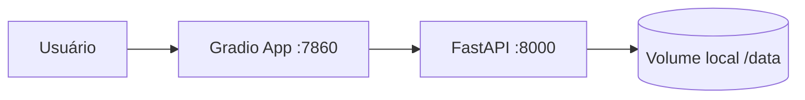

# Deploy local RAG agents with Docker + FastAPI + Gradio

Este guia mostra uma arquitetura simples para expor seus agentes RAG locais por API (FastAPI) e por interface web (Gradio), tudo em container Docker.

## 1) Arquitetura recomendada

- **Serviço 1 — API (`FastAPI`)**
  - Carrega seus agentes/índices locais uma vez no startup.
  - Expõe endpoint `POST /ask` para perguntas dos usuários.
- **Serviço 2 — Frontend (`Gradio`)**
  - Interface de chat simples.
  - Chama a API por HTTP.
- **Volume local**
  - Monte sua pasta de dados locais (PDFs, índices Chroma, etc.) no container.



## 2) Estrutura mínima de pastas

```text
.
├── docker-compose.yml
├── .env
├── app/
│   ├── api/
│   │   ├── main.py
│   │   └── rag_service.py
│   └── ui/
│       └── gradio_app.py
└── knowledge/
    ├── articles/
    ├── repos/
    └── storage/chromadb/
```

## 3) API com FastAPI

`app/api/rag_service.py`

```python
from pathlib import Path

class RAGService:
    def __init__(self, data_dir: str = "/data"):
        self.data_dir = Path(data_dir)
        # TODO: carregar aqui os índices/coleções e inicializar seus agentes
        # Exemplo: Chroma, LlamaIndex, CrewAI etc.

    def ask(self, question: str) -> str:
        # TODO: chamar o manager agent e delegar para os agentes corretos
        return f"[demo] Pergunta recebida: {question}"
```

`app/api/main.py`

```python
import os
from fastapi import FastAPI
from pydantic import BaseModel
from .rag_service import RAGService

app = FastAPI(title="RAG Agents API")
service = RAGService(data_dir=os.getenv("DATA_DIR", "/data"))

class AskRequest(BaseModel):
    question: str

class AskResponse(BaseModel):
    answer: str

@app.get("/health")
def health():
    return {"status": "ok"}

@app.post("/ask", response_model=AskResponse)
def ask(payload: AskRequest):
    answer = service.ask(payload.question)
    return AskResponse(answer=answer)
```

## 4) Frontend com Gradio

`app/ui/gradio_app.py`

```python
import os
import requests
import gradio as gr

API_URL = os.getenv("API_URL", "http://api:8000")


def ask_api(message: str, history):
    try:
        response = requests.post(
            f"{API_URL}/ask",
            json={"question": message},
            timeout=120,
        )
        response.raise_for_status()
        answer = response.json().get("answer", "Sem resposta")
    except Exception as exc:
        answer = f"Erro ao consultar API: {exc}"

    history = history or []
    history.append((message, answer))
    return history, ""


with gr.Blocks(title="RAG Agents UI") as demo:
    chatbot = gr.Chatbot(label="Assistente RAG")
    msg = gr.Textbox(label="Pergunta")
    send = gr.Button("Enviar")

    send.click(ask_api, inputs=[msg, chatbot], outputs=[chatbot, msg])

if __name__ == "__main__":
    demo.launch(server_name="0.0.0.0", server_port=7860)
```

## 5) Dependências

`requirements.txt` (exemplo mínimo)

```txt
fastapi==0.115.0
uvicorn[standard]==0.30.6
gradio==4.44.0
requests==2.32.3
# + libs do seu projeto: crewai, chromadb, llama-index, fastembed etc.
```

## 6) Dockerfiles

`app/api/Dockerfile`

```dockerfile
FROM python:3.11-slim
WORKDIR /app
COPY requirements.txt /app/requirements.txt
RUN pip install --no-cache-dir -r /app/requirements.txt
COPY app/api /app/app/api
ENV PYTHONPATH=/app
EXPOSE 8000
CMD ["uvicorn", "app.api.main:app", "--host", "0.0.0.0", "--port", "8000"]
```

`app/ui/Dockerfile`

```dockerfile
FROM python:3.11-slim
WORKDIR /app
COPY requirements.txt /app/requirements.txt
RUN pip install --no-cache-dir -r /app/requirements.txt
COPY app/ui /app/app/ui
ENV PYTHONPATH=/app
EXPOSE 7860
CMD ["python", "/app/app/ui/gradio_app.py"]
```

## 7) Docker Compose

`docker-compose.yml`

```yaml
services:
  api:
    build:
      context: .
      dockerfile: app/api/Dockerfile
    container_name: rag-api
    env_file:
      - .env
    environment:
      - DATA_DIR=/data
    volumes:
      - ./knowledge:/data:ro
    ports:
      - "8000:8000"

  ui:
    build:
      context: .
      dockerfile: app/ui/Dockerfile
    container_name: rag-ui
    depends_on:
      - api
    environment:
      - API_URL=http://api:8000
    ports:
      - "7860:7860"
```

## 8) .env (exemplo)

```env
GROQ_API_KEY=coloque_sua_chave
```

## 9) Rodando

```bash
docker compose up --build
```

- API: `http://localhost:8000/docs`
- Gradio: `http://localhost:7860`

## 10) Como conectar seus agentes atuais

1. Mova a lógica atual de consulta/roteamento para uma classe de serviço (como `RAGService`).
2. No `__init__`, carregue o ChromaDB e os agentes uma única vez.
3. No método `ask`, encaminhe a pergunta para o manager agent e devolva só a resposta final.
4. Trate exceções e timeout no endpoint `/ask`.
5. Se houver alto volume, use fila (Celery/RQ) e cache de resposta.

## 11) Boas práticas importantes

- **Não embutir dados no container**: monte via volume (`./knowledge:/data`).
- **Manter embeddings/índices compatíveis** com o modelo usado nas tools.
- **Rate limit e retries** para chamadas a LLM externa.
- **Logs estruturados** para debugar falhas de roteamento entre agentes.
- **Healthcheck** no `docker-compose` para a UI subir só após a API saudável.
